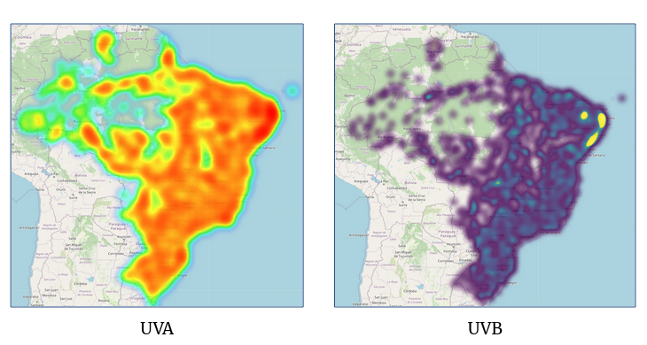
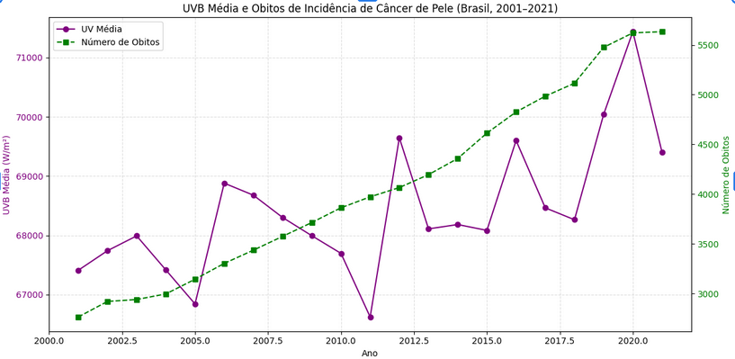

# Cancer Climate DW
A data warehouse project focused on analyzing the correlation between climate variables—such as UV radiation and temperature—and the incidence of skin cancer in Brazil. 

## 🗃️ Data Sources

- **Climate Data**: Collected from the [NASA POWER API](https://power.larc.nasa.gov/) and includes information on temperature, UVA, and UVB radiation from **2001 to 2021**.
- **Cancer Data**: Extracted from the [IHME Global Burden of Disease](https://vizhub.healthdata.org/gbd-results/) database, providing yearly statistics on **skin cancer mortality** in Brazil from **2001 to 2021**.

## ⚙️ Technologies Used

- **PostgreSQL**: For storing the integrated data warehouse.
- **Apache Spark**: For performing large-scale data transformations and ETL (Extract, Transform, Load) processes.
- **MinIO**: As an object storage service to simulate an S3-compatible data lake.

## 📈 Project Structure

All ETL operations and analytical queries were implemented using two Jupyter Notebooks:

- `etl.ipynb`: Handles climate data extraction from NASA API and processing via Spark.
- `consutas.ipynb`: Handles cancer data ingestion and integrates it with climate data for analysis.

## 🖼️ Data Visualizations

Here are two examples of the visual insights produced by the project:

### UV Radiation Maps (UVA and UVB levels across Brazil)

---

### Correlation between Skin Cancer Deaths and UVB Exposure

## 📅 Timeframe

All data ranges from **2001 to 2021**, and analyses are restricted to **Brazilian territory**.

---